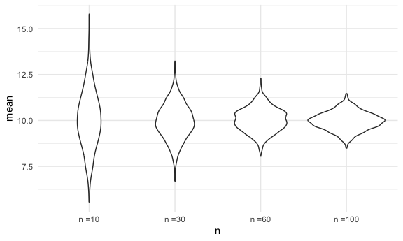
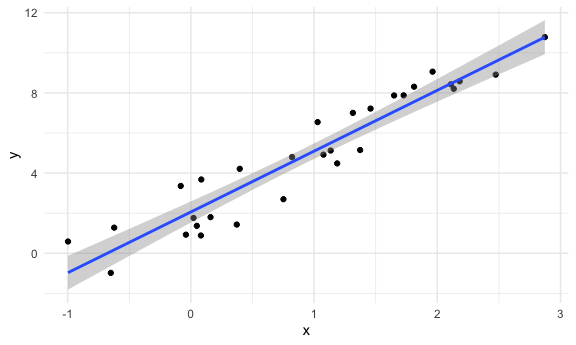
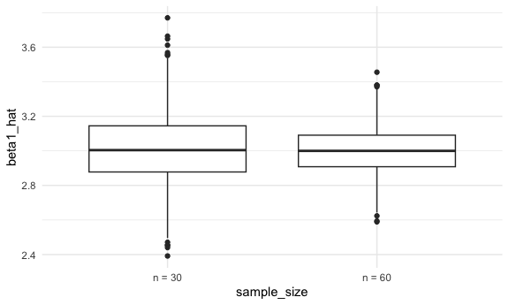
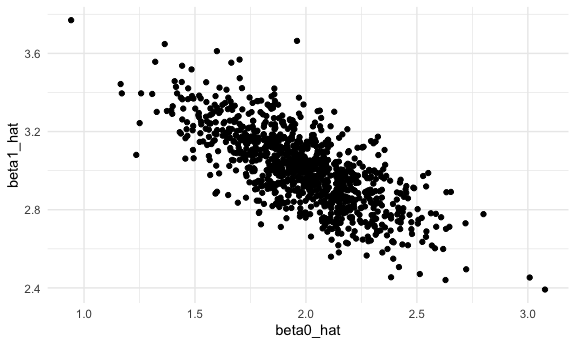
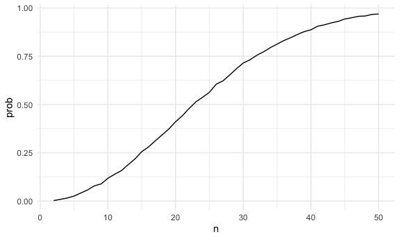

Simple document
================
Linshan Xie
2024-10-24

``` r
sim_df = 
  tibble(
    x = rnorm(30, 10, 5)
  )

sim_df |>
  summarize(
    mean = mean(x), 
    sd = sd(x)
  )
```

    ## # A tibble: 1 × 2
    ##    mean    sd
    ##   <dbl> <dbl>
    ## 1  9.00  4.87

## writing an simulation function

``` r
sim_mean_sd = function(sample_size, true_mean = 10, true_sd = 5){
  sim_df = 
    tibble(
      x = rnorm(sample_size, true_mean, true_sd))
  
  out_df = sim_df |>
    summarize(
      mean = mean(x), 
      sd = sd(x))
  
  return(out_df)
}
```

run this a lot of times

``` r
sim_mean_sd(30)
```

    ## # A tibble: 1 × 2
    ##    mean    sd
    ##   <dbl> <dbl>
    ## 1  8.45  4.65

run this using a for loop

``` r
output =vector("list", 1000)

for (i in 1:1000) {
  output[[i]] = sim_mean_sd(30)
}

bind_rows(output) |>
  summarize(ave_samp_mean = mean(mean),
            se_samp_mean = sd(mean))
```

    ## # A tibble: 1 × 2
    ##   ave_samp_mean se_samp_mean
    ##           <dbl>        <dbl>
    ## 1          9.95        0.923

set.seed(1) 可以保证每次随机过程得到的结果相同

Can i use map instead?

``` r
sim_res = 
  tibble(
    iter = 1:1000
  )|>
  mutate(samp_res = map(iter, sim_mean_sd, sample_size = 30)) |>
  unnest(samp_res)
```

could i try different sample sizes?

``` r
sim_res = 
  expand_grid(
    n = c(10, 30, 60, 100),
    iter = 1:1000
  ) |> #1-1000 n=10, 1001-2000 n=30
  mutate(samp_res = map(n, sim_mean_sd)) |>
  unnest(samp_res)
```

``` r
sim_res |>
  group_by(n) |>
  summarize(
    se = sd(mean)
  )
```

    ## # A tibble: 4 × 2
    ##       n    se
    ##   <dbl> <dbl>
    ## 1    10 1.55 
    ## 2    30 0.957
    ## 3    60 0.652
    ## 4   100 0.493

``` r
sim_res |>
  mutate(n = str_c("n =", n),
         n = fct_inorder(n))|>
  ggplot(aes(x = n, y = mean)) +
  geom_violin()
```



### SLR

``` r
sim_data = 
  tibble(
    x = rnorm(30, mean = 1, sd = 1),
    y = 2 + 3 * x + rnorm(30, 0 ,1)
  )

lm_fit = lm(y ~ x, data = sim_data)

sim_data|>
  ggplot(aes(x = x, y = y)) +
  geom_point() +
  stat_smooth(method = "lm")
```

    ## `geom_smooth()` using formula = 'y ~ x'



Turn this into a function

``` r
sim_regression = function(n){
  sim_data = 
    tibble(
      x = rnorm(n, mean = 1, sd = 1),
      y = 2 + 3 * x + rnorm(n, 0 ,1)
    )
  lm_fit = lm(y ~ x, data = sim_data)
  
  out_df = tibble(
    beta0_hat = coef(lm_fit)[1],
    beta1_hat = coef(lm_fit)[2]
  )
  return(out_df)
}
```

``` r
sim_res = expand_grid(
  sample_size = c(30, 60), 
  iter = 1:1000
) |>
  mutate(lm_res = map(sample_size, sim_regression)) |>
  unnest(lm_res)

sim_res |>
  mutate(sample_size = str_c("n = ", sample_size)) |>
  ggplot(aes(x = sample_size, y = beta1_hat)) +
  geom_boxplot()
```



``` r
sim_res |>
  filter(sample_size == 30) |>
  ggplot(aes(x = beta0_hat, y = beta1_hat)) +
  geom_point()
```



## Birthday problem!

put people in a room

``` r
bdays_sim = function(n) {
  bdays = sample(1:365, size = n, replace = TRUE)
  length(unique(bdays)) < n
  duplicate = length(unique(bdays)) < n
  return(duplicate)
}

bdays_sim(10)
```

    ## [1] FALSE

``` r
sim_res = expand_grid(
  n = 2:50,
  iter = 1:10000
) |>
  mutate(res = map_lgl(n, bdays_sim)) |>
  group_by(n) |>
  summarize(prob = mean(res))

sim_res |>
  ggplot(aes(x = n, y = prob)) +
  geom_line()
```


